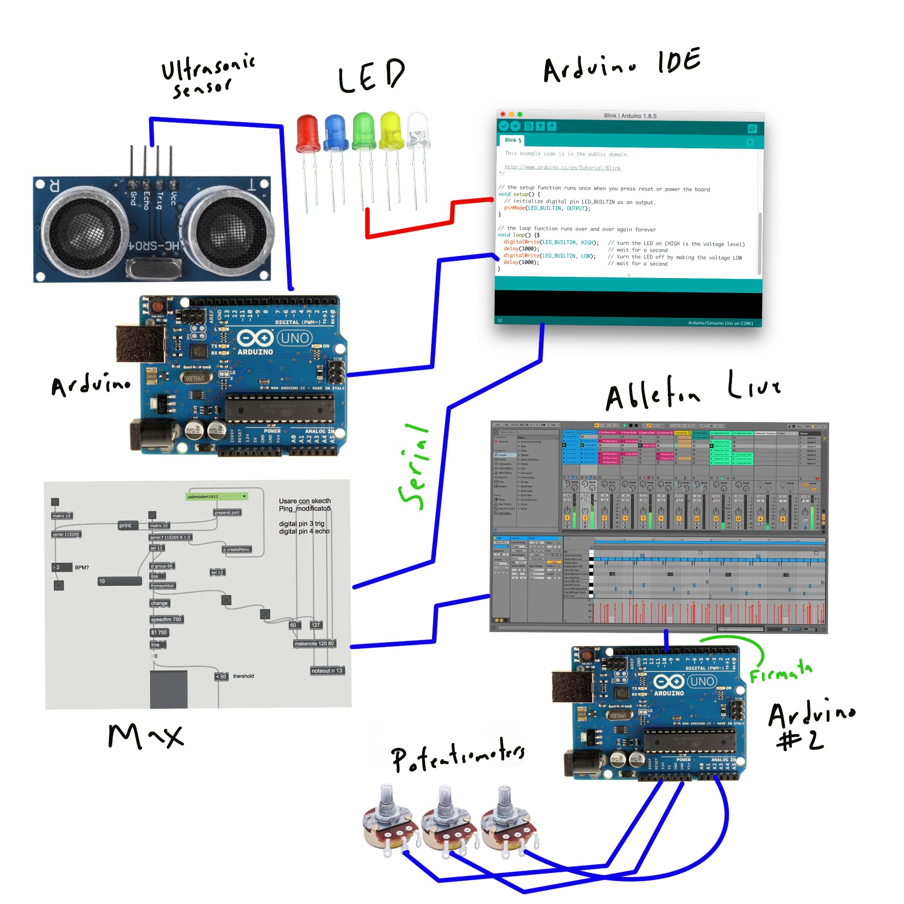

## DESIGN.md

### Final Project:

Sensorem

### Submitted by:
Mateo Larrea

### For Course:
EP-353

## Overall System: 

## Software and Hardware
### Arduino: Ultrasonic

The ultrasonic sensor is connected to Arduino (Mega) and it calculates the distance of an object to the sensor (3.2 Algorithm: Distance in cm based on sos -> distance = duration / 58.2;). Then this information passes through three stages: 1. Light System (4.1 in script), 2. Pot system (3.3 in script), and finally: Serial.println (that sends these values into Max). 

Light System turns on and off LEDs based on where (relative to the range) the user is. Similar concept of what octave a musician is playing on.

Pot System has three behaviors: 1. Going to the higher register (range), 2. Neutral (no impact in the actual distance obtained by sensor), and 3. Going to the lower register.

### Max:

The Max patch is very simple. It takes in the data via the serial object and scales the data stream into 5 MIDI Octaves. Then it outputs the information into Ableton Live

### Arduino: Controller

This piece of hardware uses a script names Firmata, a protocol to connect objects like arduinos to applications in a computer. This piece of software allows the user to map parameters in Ableton to pots in their board.  